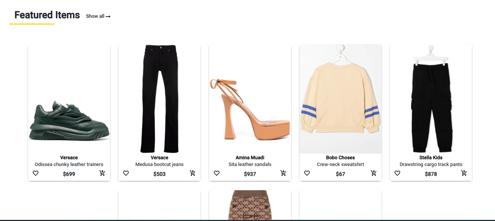
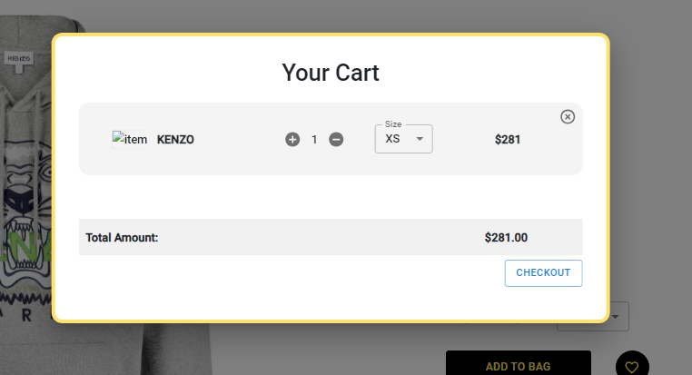
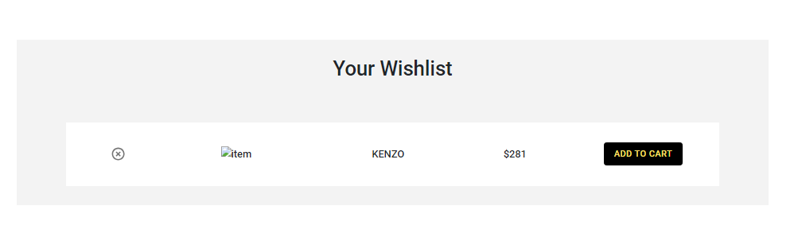
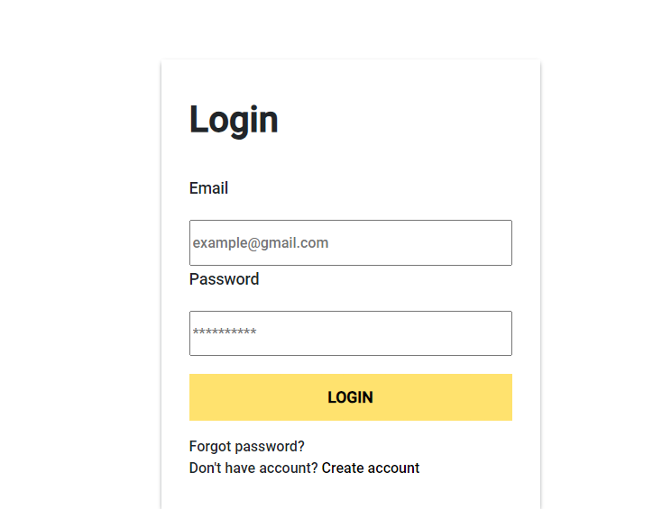

<h1>AYURA</h1>

AYURA is a MERN stack ecommerce project that provides a platform for users to browse and purchase items for men, women, and kids. It includes features like adding items to the cart, wishlist, and user authentication.

<h2>How to Run Manually</h2>
<ol>
<li><strong>Download the Project</strong>: Clone or download the repository to your local machine.</li>
<li><strong>Navigate to the Project Folder</strong>: Open the project folder where the <code>package.json</code> file is located.</li>
<li><strong>Install Dependencies</strong>: Open your terminal and run:
<pre><code>npm i</code></pre>
</li>
<li><strong>Start the Application</strong>
<pre><code>npm start</code></pre>
</li>
<li><strong>Access the Website</strong>: You will be redirected to the website.</li>
</ol>

<h2>Features</h2>

<h3>Selecting Items for Men, Women, and Kids</h3>

<h3>Add Items to Cart</h3>

<h3>Add Items to Wishlist</h3>

<h3>Login / Registration</h3>

<h2>Made by Aayush</h2>
